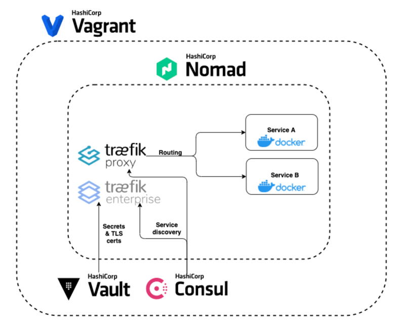

# Simple HashiCorp and Traefik Environment



## Getting Started

You can use Vagrant to set up this lab environment. Vagrant is
a tool for building and managing virtual machine environments.

~> **NOTE**: To use the Vagrant environment, first install Vagrant following
these [instructions](https://www.vagrantup.com/docs/installation/). You also
need a virtualization tool, such as [VirtualBox](https://www.virtualbox.org/).

From a terminal in this folder, you may create the virtual machine with the `vagrant up` command.

```shell-session
$ vagrant up
```

This takes a few minutes as the base Ubuntu box must be downloaded
and provisioned with Docker, Nomad, Consul, and Vault. Once this completes, you should see this output.

```plaintext hideClipboard
Bringing machine 'default' up with 'virtualbox' provider...
==> default: Importing base box 'hashicorp/bionic64'...
...
==> default: Running provisioner: shell...
```

Once this provisioning completes, use the `vagrant ssh` command to start a shell session on it.

```shell-session
$ vagrant ssh
```

If you connect to the virtual machine properly, you should find yourself at a
shell prompt for `vagrant@vagrant:~$`

Please note that in this lab environment Nomad, Consul, and Vault are configured in `dev` mode. This mode is useful for developing or testing because it doesn't require any extra configuration, and does not persist any state to disk.

**Warning**: Never run -dev mode in production.

## Accessing the environment

You may view the Nomad, Consul, and Vault interfaces with a web browser. Please access here:
- Nomad UI http://localhost:4646/
- Consul UI http://localhost:8500/
- Vault UI http://localhost:8200/

Verifying Consul Connect:
- http://localhost:9002 should display a working countdash
- http://localhost:8080/whoami should display something like:

```
Hostname: 38fe7a2efb13
IP: 127.0.0.1
IP: 172.26.64.5
RemoteAddr: 127.0.0.1:53402
GET /whoami HTTP/1.1
Host: localhost:8080
User-Agent: Mozilla/5.0 (Macintosh; Intel Mac OS X 10_15_7) AppleWebKit/605.1.15 (KHTML, like Gecko) Version/14.1.2 Safari/605.1.15
Accept: text/html,application/xhtml+xml,application/xml;q=0.9,*/*;q=0.8
Accept-Encoding: gzip, deflate
Accept-Language: en-us
Upgrade-Insecure-Requests: 1
X-Forwarded-For: 10.0.2.2
X-Forwarded-Host: localhost:8080
X-Forwarded-Port: 8080
X-Forwarded-Proto: http
X-Forwarded-Server: vagrant
X-Real-Ip: 10.0.2.2
```

*Note*: If any of these do not work, please check your Vagrant output. If there is a port collision on your system Vagrant may assign a different port.

## Cleaning up

### Halt the VM

Stop running jobs and exit any shell sessions that you made to the virtual machine. Use the `vagrant halt` command to stop the running VM.

```shell-session
$ vagrant halt
```

At this point, you can start the VM again without having to provision it.

### De-provision the VM

If you don't anticipate using the training VM for a while, and don't mind the
time necessary to provision it, you can deprovision the VM. From this folder,
use the `vagrant destroy` command to deprovision the environment you created.
The command verifies that you intend to perform this activity; enter `Y` at the
prompt to confirm that you do.

```shell-session
$ vagrant destroy
```

```plaintext
    default: Are you sure you want to destroy the 'default' VM? [y/N] y
==> default: Forcing shutdown of VM...
==> default: Destroying VM and associated drives...
```

De-provisioning the environment deletes the VM that was created based on the base
box.

### Remove the base box

If you don't intend to use the Vagrant environment ever again, you can also
delete the downloaded Vagrant base box used to create the VM by running the
`vagrant box remove` command. Don't worry, if you decide to use the environment
again later, Vagrant re-downloads the base box when you need it.

```shell-session
$ vagrant box remove hashicorp/bionic64
```

```plaintext
Removing box 'hashicorp/bionic64' (v1.0.282) with provider 'virtualbox'...
```

At this point, you have removed all of the parts that are added by starting up
the Vagrantfile.

## Documentation and References
- [Traefik](https://doc.traefik.io/traefik/)
- [Introduction to Consul](https://learn.hashicorp.com/tutorials/consul/get-started?in=consul/getting-started)
- [Introduction to Vault](https://learn.hashicorp.com/tutorials/vault/getting-started-intro?in=vault/getting-started)
- [Introduction to Nomad](https://learn.hashicorp.com/tutorials/nomad/get-started-intro?in=nomad/get-started)
- [Using Traefik on Nomad](https://atodorov.me/2021/03/27/using-traefik-on-nomad/)
- [Integrating Consul Connect Service Mesh with Traefik 2.5](https://traefik.io/blog/integrating-consul-connect-service-mesh-with-traefik-2-5/)